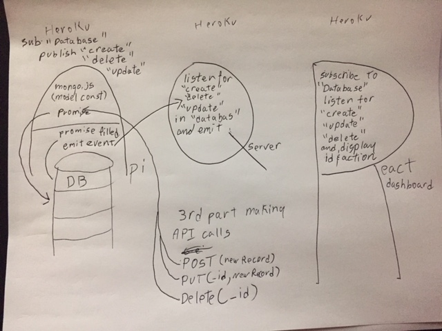

 LAB
=================================================

## Database Dashboard

### Author: Student/Group Name
### Links and Resources
* [repo](https://github.com/jaredpattison/databaseDashboard)
* [travis]()
* [back-end-q](https://jared-q-server-dashboard.herokuapp.com/)
* [back-end-api](https://jared-api-server-dashboard.herokuapp.com/api/v1/)
* [front-end](https://jared-dashboard.herokuapp.com/)

### Modules
#### `modulename.js`
##### Exported Values and Methods

###### `foo(thing) -> string`
Usage Notes or examples

###### `bar(array) -> array`
Usage Notes or examples

### Setup
#### `.env` requirements
* `PORT` - Port Number
* `MONGODB_URI` - URL to the running mongo instance/db

#### Running the app
* `npm start`
* Endpoint: `/foo/bar/`
  * Returns a JSON object with abc in it.
* Endpoint: `/bing/zing/`
  * Returns a JSON object with xyz in it.

#### Tests
* echo '{"name":"Test Team 4"}' | http post https://jared-api-server-dashboard.herokuapp.com/api/v1/teams
* http delete https://jared-api-server-dashboard.herokuapp.com/api/v1/teams/5c6a1713660d49001725a172

#### UML
